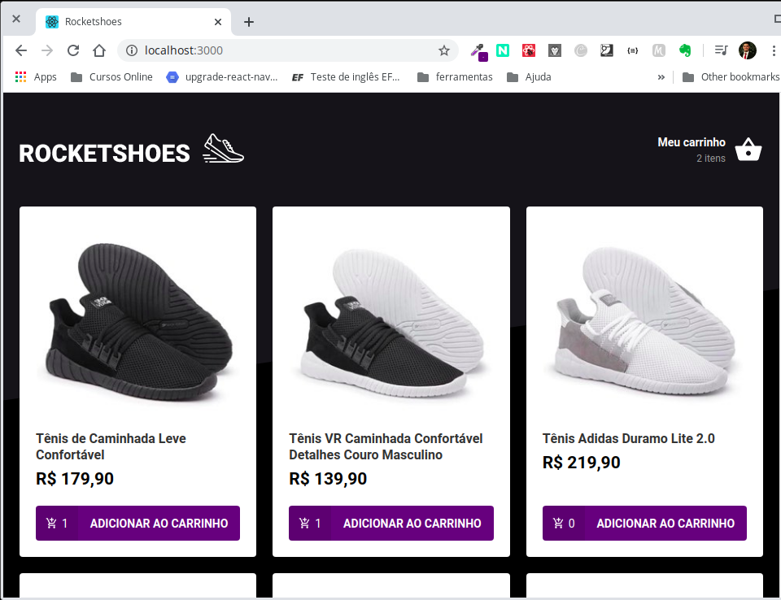

<h2 align="center">Interface E-commerce em ReactJS com Arquitetura Flux</h2>

  

  

  

  

  <a href="https://github.com/rlocatelli9/rocketshoes-web/blob/master/LICENSE.md">
    
  <a>

  <a href="#bookmark_tabs-tecnologias">Tecnologias</a>&nbsp;&nbsp;&nbsp;|&nbsp;&nbsp;&nbsp;
  <a href="#-projeto">Projeto</a>&nbsp;&nbsp;&nbsp;|&nbsp;&nbsp;&nbsp;
  <a href="#-como-contribuir">Como contribuir</a>&nbsp;&nbsp;&nbsp;|&nbsp;&nbsp;&nbsp;
  <a href="#memo-licença">Licença</a>

<h1 align="center">

</h1>

## :bookmark_tabs: Tecnologias

Technologies highlighted in use:

- [ReactJS](https://reactjs.org/)
- [react-router-dom](https://www.npmjs.com/package/react-router-dom)
- [react-icons](https://www.npmjs.com/package/react-icons)
- [axios](https://www.npmjs.com/package/axios)
- [redux](https://redux.js.org/)
- [redux-saga](https://redux-saga.js.org/)
- [react-toastify](https://github.com/fkhadra/react-toastify)
- [prop-types](https://www.npmjs.com/package/prop-types)
- [styled-components](https://www.npmjs.com/package/styled-components)

## 💻 Projeto

Aplicação do zero utilizando ReactJS.

Nessa aplicação foi desenvolvido uma interface utilizando ReactJS, Redux e Redux Saga para compartilhamento de estados. Projeto prático de E-commecer onde determinados estados na aplicação eram compartilhados para que outros componentes pudessem ouvir.

## 🤔 Como contribuir

- Faça um fork desse repositório;
- Cria uma branch com a sua feature: `git checkout -b minha-feature`;
- Faça commit das suas alterações: `git commit -m 'feat: Minha nova feature'`;
- Faça push para a sua branch: `git push origin minha-feature`.

Depois que o merge da sua pull request for feito, você pode deletar a sua branch.

## :memo: Licença

Esse projeto está sob a licença MIT. Veja o arquivo [LICENSE](LICENSE.md) para mais detalhes.
